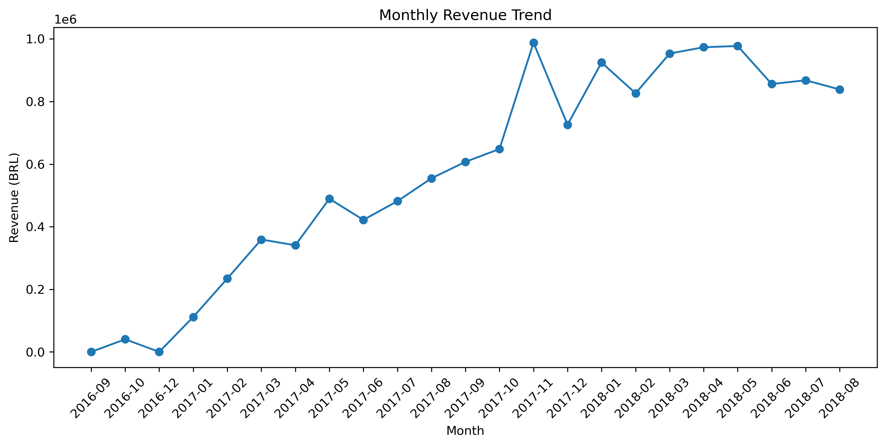
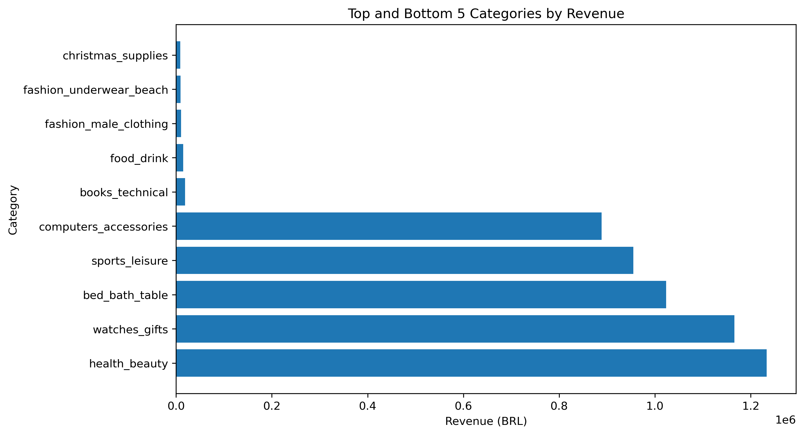
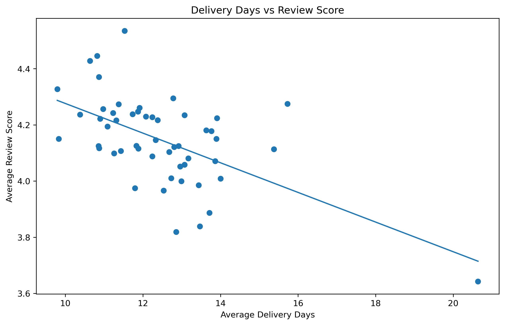

# Olist E-Commerce KPI Framework

An end-to-end e-commerce analytics project using the Olist Brazilian E-Commerce dataset. The project combines SQLite, SQL, and Python to analyze revenue, orders, categories, sellers, delivery performance, and customer reviews.

## Project Overview

The project models the Olist marketplace as a relational database and builds a reusable KPI framework.

Main objectives:

- Design a relational SQLite database
- Define primary and foreign keys
- Analyze multi-table relationships and join cardinality
- Build a reusable analytical SQL view
- Calculate e-commerce KPIs
- Analyze category, monthly, and seller performance
- Perform revenue reconciliation
- Analyze delivery and customer satisfaction
- Perform additional shipping and review analysis
- Visualize results using Python

## Dataset

Source: [Olist Brazilian E-Commerce Dataset](https://www.kaggle.com/datasets/olistbr/brazilian-ecommerce)

Tables used:

- `orders`
- `order_items`
- `products`
- `order_reviews`
- `sellers`
- `customers`
- `product_category_name_translation`

## Database Schema


Main relationships:

```text
customers 1:N orders
orders 1:N order_items
products 1:N order_items
sellers 1:N order_items
orders 1:N order_reviews
products N:1 category_translation
```

The `order_items` table uses a composite primary key:

```text
(order_id, order_item_id)
```

`order_reviews` does not use `review_id` as a primary key because duplicate review IDs exist in the source data.

## Analytical Base

A reusable SQL `VIEW` called `analytical_base` was created.

It combines:

```text
orders
   ↓
order_items
   ↓
products
   ↓
category translation
   ↓
aggregated reviews
```

Only delivered orders are included.

The analytical base has an order-item grain and contains delivery, category, review, price, and freight information.

## Join Strategy

- `orders → order_items`: `INNER JOIN`
- `order_items → products`: `INNER JOIN`
- `products → category translation`: `LEFT JOIN`
- `orders → reviews`: `LEFT JOIN`

Reviews are aggregated by `order_id` before joining to prevent row multiplication.

## SQL Analysis

### Q1 — Data and Join Cardinality

- Orders: 99,441
- Order items: 112,650
- Reviews: 99,224
- Products: 32,951
- Sellers: 3,095
- Customers: 99,441
- Category translations: 71
- Average items per order: 1.1417

### Q2 — Analytical Base

- 110,197 analytical item rows
- 96,478 distinct delivered orders
- 32,216 distinct products

### Q3 — Revenue Reconciliation

Direct revenue:

**BRL 13,221,498.11**

Naive joined revenue:

**BRL 13,279,836.59**

Revenue inflation:

**BRL 58,338.48**

Corrected revenue:

**BRL 13,221,498.11**

Reconciliation difference:

**BRL 0.00**

The inflation occurred because directly joining reviews to order items can multiply item rows. Aggregating reviews to one row per order before joining solves the problem.

### Q4 — Overall KPIs

| KPI | Result |
|---|---:|
| Total Revenue | BRL 13,221,498.11 |
| Average Order Value | BRL 137.04 |
| Average Delivery Time | 12.56 days |
| Average Review Score | 4.16 |

### Q5 — Category KPIs

Top revenue categories:

| Category | Revenue |
|---|---:|
| health_beauty | BRL 1,233,131.72 |
| watches_gifts | BRL 1,166,176.98 |
| bed_bath_table | BRL 1,023,434.76 |
| sports_leisure | BRL 954,852.55 |
| computers_accessories | BRL 888,724.61 |

### Q6 — Monthly KPIs

Monthly revenue, AOV, delivery time, review score, and order count are calculated directly in SQL using `GROUP BY` and SQLite date functions.

### Q7 — Revenue Rankings

Top categories:

1. health_beauty
2. watches_gifts
3. bed_bath_table
4. sports_leisure
5. computers_accessories

Bottom categories:

1. christmas_supplies
2. fashion_underwear_beach
3. fashion_male_clothing
4. food_drink
5. books_technical

A minimum of 100 orders was used to reduce low-volume noise.

### Q8 — Review Rankings

Highest review scores:

| Category | Review |
|---|---:|
| books_general_interest | 4.53 |
| food_drink | 4.45 |
| books_technical | 4.43 |
| luggage_accessories | 4.37 |
| food | 4.33 |

Lowest review scores:

| Category | Review |
|---|---:|
| office_furniture | 3.64 |
| fashion_male_clothing | 3.82 |
| audio | 3.84 |
| home_confort | 3.89 |
| fixed_telephony | 3.97 |

### Q9 — Seller KPIs

Seller analysis includes:

- Revenue
- Order count
- Average delivery days
- Average review score
- Revenue ranking using `RANK()`

One high-revenue seller had approximately 22.34 delivery days and a 3.50 average review score, showing that revenue alone does not indicate strong operational performance.

### Q10 — Delivery and Review Analysis

The category-level correlation between delivery time and review score is:

**-0.5765**

This indicates a moderate negative association between delivery time and customer satisfaction.

## Python Visualizations

### Monthly Revenue Trend



### Top and Bottom Categories by Revenue



### Delivery Days vs Review Score



The visualizations were created using Pandas, NumPy, and Matplotlib.

## Bonus Analysis

### On-Time Delivery

On-time delivery rate:

**91.89%**

### Orders Without Reviews

- Orders without reviews: 768
- Share: 0.77%

### Freight Cost to Revenue

15 categories were identified with a freight-to-revenue ratio above 25%.

Highest examples:

| Category | Freight / Revenue |
|---|---:|
| casa_conforto_2 | 53.97% |
| flores | 44.04% |
| moveis_colchao_e_estofado | 36.58% |
| artigos_de_natal | 36.52% |
| fraldas_higiene | 36.34% |

### Monthly Category Revenue Share

A SQL window function was used to calculate each category's share of monthly revenue:

```sql
SUM(revenue) OVER (PARTITION BY month)
```

Example from October 2017:

| Category | Share |
|---|---:|
| relogios_presentes | 10.27% |
| esporte_lazer | 7.69% |
| cama_mesa_banho | 7.28% |
| cool_stuff | 7.02% |
| informatica_acessorios | 6.65% |

## Operational Insights

1. Revenue is concentrated in major categories such as health_beauty, watches_gifts, and bed_bath_table.
2. Longer delivery times are associated with lower review scores.
3. Office furniture is a significant operational risk with 20.64 average delivery days and a 3.64 review score.
4. High revenue does not always mean high customer satisfaction.
5. Seller performance should be evaluated using revenue, delivery, and review KPIs together.

## SQL Concepts Used

- `CREATE TABLE`
- Primary Keys
- Foreign Keys
- `INNER JOIN`
- `LEFT JOIN`
- `GROUP BY`
- `HAVING`
- `ORDER BY`
- `CASE`
- `COALESCE`
- CTEs
- SQL `VIEW`
- Aggregate functions
- SQLite date functions
- Window functions
- `RANK()`
- `SUM() OVER()`
- Anti-joins
- Revenue reconciliation

## Technologies

- SQLite
- SQL
- Python
- Pandas
- NumPy
- Matplotlib
- Jupyter Notebook
- DB Browser for SQLite
- Git
- GitHub

## Project Structure

```text
olist-ecommerce-kpi/
│
├── README.md
├── note.md
├── queries.sql
├── olist_kpi_analysis.ipynb
├── olist_er_diagram.png
├── monthly_revenue_trend.png
├── top_bottom_categories_revenue.png
├── delivery_vs_review_score.png
└── .gitignore
```

The raw dataset and SQLite database are not included in the GitHub repository because of file size. The original dataset is available through the Kaggle link above.

## Key Results

| Metric | Result |
|---|---:|
| Total Revenue | BRL 13,221,498.11 |
| AOV | BRL 137.04 |
| Avg. Delivery Time | 12.56 days |
| Avg. Review Score | 4.16 |
| On-Time Delivery | 91.89% |
| Orders Without Reviews | 768 |
| No-Review Share | 0.77% |
| Revenue Join Inflation | BRL 58,338.48 |
| Reconciliation Difference | BRL 0.00 |
| Delivery/Review Correlation | -0.5765 |
| High Shipping Impact Categories | 15 |

## Conclusion

This project demonstrates an end-to-end e-commerce analytics workflow, from relational database design and SQL analysis to Python visualization and business insights.

A key finding is the importance of controlling join cardinality. After correcting review joins, the analytical revenue reconciles exactly with the direct revenue calculation at **BRL 13,221,498.11**.

The project combines financial, operational, and customer-experience metrics to provide a structured view of Olist e-commerce performance.
