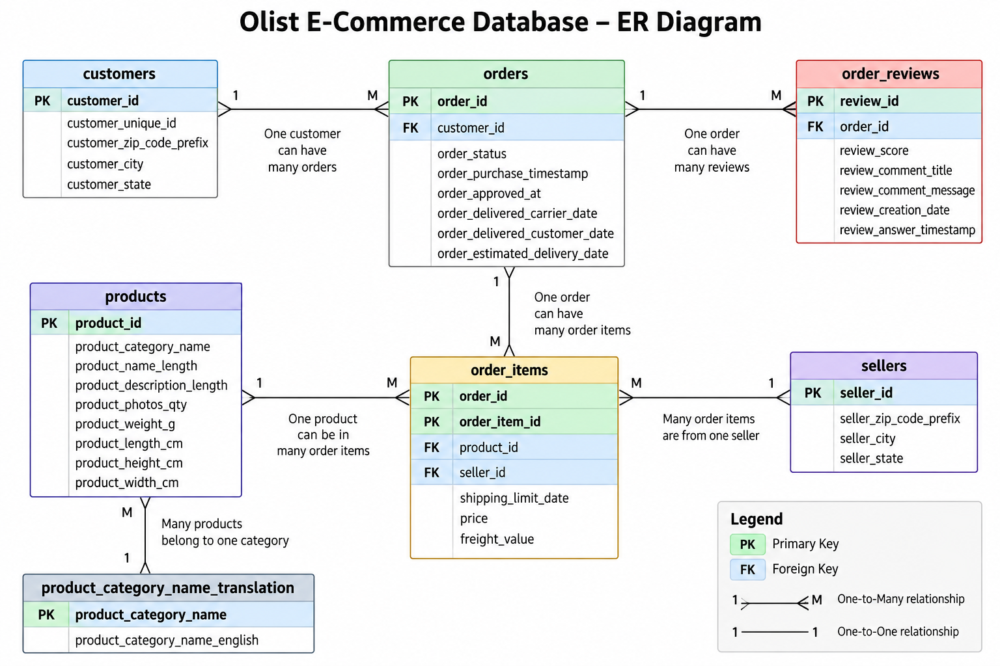

# Database Design & Analytical Notes

## 1. Project Overview

This project analyzes the Olist Brazilian E-Commerce dataset using SQLite and SQL.

The database models the main entities of the Olist marketplace and supports KPI analysis related to revenue, orders, categories, sellers, delivery performance, and customer reviews.

---

## 2. ER Sketch

```text
customers
    |
    | 1 : M
    v
  orders
    |
    | 1 : M
    v
order_items
   / \
  /   \
 M:1   M:1
 /       \
v         v
products  sellers
   |
   | M : 1
   v
product_category_name_translation

orders
   |
   | 1 : M
   v
order_reviews
```

### Relationships

| Relationship | Cardinality | Key |
|---|---|---|
| customers → orders | 1 : M | `customer_id` |
| orders → order_items | 1 : M | `order_id` |
| products → order_items | 1 : M | `product_id` |
| sellers → order_items | 1 : M | `seller_id` |
| orders → order_reviews | 1 : M | `order_id` |
| products → category translation | M : 1 | `product_category_name` |

---



## 3. Primary Keys

- `orders.order_id`
- `customers.customer_id`
- `sellers.seller_id`
- `products.product_id`
- `product_category_name_translation.product_category_name`

`order_items` uses a composite primary key:

```text
(order_id, order_item_id)
```

The `order_reviews` table does not use `review_id` as a primary key because duplicate review IDs exist in the source data.

---

## 4. Join-Type Choices

### Orders → Order Items: INNER JOIN

An `INNER JOIN` is used because the analytical dataset requires orders that have corresponding order items.

```sql
INNER JOIN order_items oi
    ON o.order_id = oi.order_id
```

This is a one-to-many relationship because one order can contain multiple items.

### Order Items → Products: INNER JOIN

An `INNER JOIN` is used because product information is required for product and category analysis.

```sql
INNER JOIN products p
    ON oi.product_id = p.product_id
```

### Products → Category Translation: LEFT JOIN

A `LEFT JOIN` is used because some product categories may not have an English translation. This keeps the product record even when a translation is unavailable.

```sql
LEFT JOIN product_category_name_translation pct
    ON p.product_category_name = pct.product_category_name
```

### Orders → Reviews: LEFT JOIN

A `LEFT JOIN` is used because some delivered orders do not have reviews. This keeps those orders in the analytical base.

Reviews are aggregated by `order_id` before the join so that multiple review records do not multiply order-item rows.

```sql
LEFT JOIN review_agg r
    ON o.order_id = r.order_id
```

---

## 5. Analytical Base

A reusable SQL view called `analytical_base` combines:

```text
orders
   ↓
order_items
   ↓
products
   ↓
category translation
   ↓
aggregated reviews
```

Only delivered orders are included.

The analytical base has a grain of **one row per order item**.

It also contains:

- delivery days
- delivery vs. estimated days
- average review score
- review count
- English category name

Reviews are aggregated first:

```sql
WITH review_agg AS (
    SELECT
        order_id,
        AVG(review_score) AS avg_review_score,
        COUNT(*) AS review_count
    FROM order_reviews
    GROUP BY order_id
)
```

---

## 6. Q3 — Revenue Reconciliation

Revenue reconciliation checks whether joining multiple tables changes the correct revenue total.

### Direct Revenue

Delivered order-item revenue:

**BRL 13,221,498.11**

### Naive Joined Revenue

Joining `order_reviews` directly to the order-item data produces:

**BRL 13,279,836.59**

This creates an inflation of:

**BRL 58,338.48**

### Corrected Revenue

After aggregating reviews to one row per order before joining:

**BRL 13,221,498.11**

### Reconciliation Difference

**BRL 0.00**

### Why the Inflation Happens

An order can have multiple order items and multiple review records. A direct join between these tables can multiply item rows.

For example:

```text
Order A
 ├── Item 1
 ├── Item 2
 ├── Review 1
 └── Review 2
```

A direct join can produce four combinations:

```text
Item 1 → Review 1
Item 1 → Review 2
Item 2 → Review 1
Item 2 → Review 2
```

The item prices are then counted multiple times.

### Fix

Reviews are aggregated to the order level first:

```text
order_reviews
      ↓
GROUP BY order_id
      ↓
one review record per order
      ↓
JOIN with order_items
```

This prevents join multiplication and preserves the correct revenue.

---

## 7. Main KPI Results

| KPI | Result |
|---|---:|
| Total Revenue | BRL 13,221,498.11 |
| Average Order Value | BRL 137.04 |
| Average Delivery Time | 12.56 days |
| Average Review Score | 4.16 |

---

## 8. Query Coverage

### Q1 — Data and Join Cardinality
- Row counts for each table
- Orders/order-items join cardinality
- Average items per order

### Q2 — Analytical Base
- Reusable analytical view
- Delivered orders
- Products and categories
- Aggregated reviews

### Q3 — Revenue Reconciliation
- Direct revenue
- Naive joined revenue
- Corrected revenue
- Reconciliation difference

### Q4 — Overall KPIs
- Total revenue
- Average order value
- Average delivery days
- Average review score

### Q5 — Category KPIs
- Revenue
- Average order value
- Average delivery days
- Average review score
- Order count

### Q6 — Monthly KPIs
- Revenue
- Average order value
- Average delivery days
- Average review score
- Order count

### Q7 — Revenue Rankings
- Top 5 categories by revenue
- Bottom 5 categories by revenue

### Q8 — Review Rankings
- Top 5 categories by average review score
- Bottom 5 categories by average review score
- Minimum 100 orders using `HAVING`

### Q9 — Seller KPIs
- Seller revenue
- Order count
- Average delivery days
- Average review score
- Revenue rank using `RANK()`

### Q10 — Delivery and Review Analysis
- Category-level average delivery days
- Category-level average review score
- Order count threshold

---

## 9. Notebook Analysis

The Jupyter Notebook `olist_kpi_analysis.ipynb` uses SQL results for:

1. Monthly revenue trend
2. Top and bottom 5 categories by revenue
3. Delivery days vs. review score scatter plot
4. Pearson correlation between delivery time and review score

The correlation is:

**r = -0.5765**

This indicates a moderate negative association between delivery time and review score. It does not prove causation.

The three figures are saved as:

- `monthly_revenue_trend.png`
- `top_bottom_categories_revenue.png`
- `delivery_vs_review_score.png`

---

## 10. Five Operational Insights

### 1. Revenue Concentration

Health & Beauty generated approximately **BRL 1.23M**, followed by Watches & Gifts at approximately **BRL 1.17M** and Bed & Bath Table at approximately **BRL 1.02M**.

**Action:** Prioritize inventory, seller capacity, and fulfillment resources for major revenue-generating categories.

### 2. Delivery and Customer Satisfaction

The correlation between delivery time and review score is **-0.58**, indicating that categories with longer delivery times tend to have lower review scores.

**Action:** Reducing delivery delays should be a priority for improving customer experience.

### 3. Office Furniture Is a Service Risk

Office Furniture has an average delivery time of approximately **20.64 days** and an average review score of **3.64**, based on **1,254 orders**.

**Action:** Investigate fulfillment, seller performance, and logistics issues in this category.

### 4. Revenue Does Not Always Mean Higher Satisfaction

Bed & Bath Table generated more than **BRL 1.02M** but had an average review score of approximately **4.00**, while Books General Interest had an average review score of approximately **4.53**.

**Action:** Monitor financial KPIs together with customer-experience KPIs.

### 5. Operations Should Scale With Demand

Monthly revenue approaches approximately **BRL 1M** in several periods.

**Action:** Logistics and fulfillment capacity should scale with sales demand to maintain delivery performance and customer satisfaction.


---

## 10. Bonus Features

### 10.1 SQL VIEW for the Analytical Base

A reusable SQL `VIEW` called `analytical_base` is used as the foundation for the KPI queries.

This allows the main KPI analysis to be rebuilt on top of a consistent analytical layer instead of repeating the full multi-table join.

### 10.2 On-Time Delivery Rate

The on-time delivery rate measures the share of orders delivered on or before the estimated delivery date.

**Result: 91.89%**

Distinct orders are used so that orders containing multiple items are counted only once.

### 10.3 Orders Without Reviews

An anti-join is used to identify orders that never received a review.

**Results:**

- Orders without reviews: **768**
- Share without reviews: **0.77%**

The anti-join logic identifies orders for which no matching review record exists.

### 10.4 Freight-Cost-to-Revenue Ratio

The freight-cost-to-revenue ratio is calculated per category as:

```text
Freight Cost / Revenue × 100
```

Categories above **25%** are flagged as **High Shipping Impact**.

There are **15 categories** above this threshold.

#### Highest Freight/Revenue Ratios

| Category | Freight / Revenue |
|---|---:|
| casa_conforto_2 | **53.97%** |
| flores | **44.04%** |
| moveis_colchao_e_estofado | **36.58%** |
| artigos_de_natal | **36.52%** |
| fraldas_higiene | **36.34%** |
| cds_dvds_musicais | **30.82%** |
| sinalizacao_e_seguranca | **30.39%** |
| eletronicos | **29.46%** |
| alimentos_bebidas | **29.41%** |
| dvds_blu_ray | **27.02%** |

These categories have relatively high shipping costs compared with their revenue and may require logistics, pricing, or fulfillment attention.

### 10.5 Monthly Category Revenue Share

A window function is used to calculate each category's share of monthly revenue:

```sql
SUM(revenue) OVER (PARTITION BY month)
```

This allows category contribution to be compared across months.

#### October 2017 Example

| Category | Monthly Share |
|---|---:|
| relogios_presentes | **10.27%** |
| esporte_lazer | **7.69%** |
| cama_mesa_banho | **7.28%** |
| cool_stuff | **7.02%** |
| informatica_acessorios | **6.65%** |
| beleza_saude | **6.44%** |
| pcs | **6.39%** |
| brinquedos | **5.27%** |
| moveis_decoracao | **4.75%** |

The monthly-share output can be used to track how category contribution shifts over time.


---

## 11. Conclusion

The project provides an end-to-end KPI framework for the Olist marketplace.

SQL is used for database modeling, joins, aggregation, KPI calculations, ranking, and revenue reconciliation. Python is used to visualize the SQL results and analyze the relationship between delivery performance and customer reviews.

The analysis connects financial, operational, and customer-experience metrics to support data-driven e-commerce decisions.
